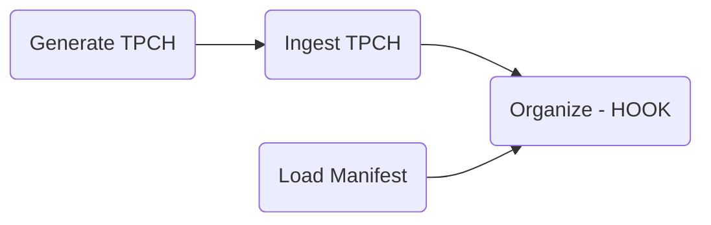
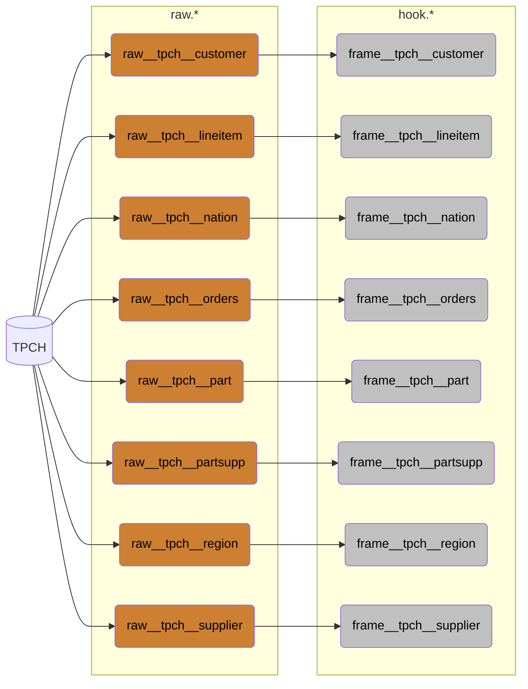

# Fabric Blueprint Modelling

In this project I explore the concept of building a solution based on blueprints, driven by a manifest.

I generate TPCH with a scale factor of 1000, divided into 1000 parts, so each run will incrementally generate, ingest, and organize one part at a time.

All is done within a single *Fabric Lakehouse* and leveraging *Materialized Lake Views (MLV)*.
Currently the MLVs are fully refreshed, but I'm hoping Microsoft will release incremental refreshes soon.

SQLGlot is used for both the blueprint generation, but also for comparing the current MLV expression, to decide if the MLV should be refreshed or recreated.

## Notebook Orchestration


## Lineage


## Manifest
```yaml
concepts:

  - name: part
    description: A part in the product catalog (p_part).

  - name: supplier
    description: A supplier company (s_supp).

  - name: customer
    description: A customer account (c_cust).

  - name: order
    description: Sales order header (o_order).

  - name: line
    description: Sales order line item (l_line).

  - name: partsupp
    description: Supplier’s offer for a specific part (ps_partsupp).

  - name: nation
    description: Nation for geo segmentation (n_nation).

  - name: region
    description: Region for geo segmentation (r_region).


keysets:

  - name: tpch:part:partkey
    concept: part
    source_system: tpch
    description: Native PART identifier from p_partkey

  - name: tpch:supplier:suppkey
    concept: supplier
    source_system: tpch
    description: Native SUPPLIER identifier from s_suppkey

  - name: tpch:customer:custkey
    concept: customer
    source_system: tpch
    description: Native CUSTOMER identifier from c_custkey

  - name: tpch:order:orderkey
    concept: order
    source_system: tpch
    description: Native ORDERS identifier from o_orderkey

  - name: tpch:line:orderkey:linenumber
    concept: line
    source_system: tpch
    description: Composed LINEITEM identifier from (l_orderkey, l_linenumber)

  - name: tpch:partsupp:partkey:suppkey
    concept: partsupp
    source_system: tpch
    description: Composed PARTSUPP identifier from (ps_partkey, ps_suppkey)

  - name: tpch:nation:nationkey
    concept: nation
    source_system: tpch
    description: Native NATION identifier from n_nationkey

  - name: tpch:region:regionkey
    concept: region
    source_system: tpch
    description: Native REGION identifier from r_regionkey


frames:

  - name: part
    source: tpch
    generate: True
    description: Catalog of parts.
    hooks:

      - name: hook__part
        concept: part
        keyset: tpch:part:partkey
        business_key_field: p_partkey

  - name: supplier
    source: tpch
    generate: True
    description: Supplier master data.
    hooks:

      - name: hook__supplier
        concept: supplier
        keyset: tpch:supplier:suppkey
        business_key_field: s_suppkey

      - name: hook__nation
        concept: nation
        keyset: tpch:nation:nationkey
        business_key_field: s_nationkey

  - name: customer
    source: tpch
    generate: True
    description: Customer master data.
    hooks:

      - name: hook__customer
        concept: customer
        keyset: tpch:customer:custkey
        business_key_field: c_custkey

      - name: hook__nation
        concept: nation
        keyset: tpch:nation:nationkey
        business_key_field: c_nationkey

  - name: orders
    source: tpch
    generate: True
    description: Orders header.
    hooks:

      - name: hook__order
        concept: order
        keyset: tpch:order:orderkey
        business_key_field: o_orderkey

      - name: hook__customer
        concept: customer
        keyset: tpch:customer:custkey
        business_key_field: o_custkey

  - name: lineitem
    source: tpch
    generate: True
    description: Order line facts.
    hooks:

      - name: hook__line
        concept: line
        keyset: tpch:line:orderkey:linenumber
        business_key_field: CONCAT(CAST(l_orderkey AS STRING), '|', CAST(l_linenumber AS STRING))

      - name: hook__order
        concept: order
        keyset: tpch:order:orderkey
        business_key_field: l_orderkey

      - name: hook__part
        concept: part
        keyset: tpch:part:partkey
        business_key_field: l_partkey

      - name: hook__supplier
        concept: supplier
        keyset: tpch:supplier:suppkey
        business_key_field: l_suppkey

  - name: partsupp
    source: tpch
    generate: True
    description: Supplier-part offers with costs and availability.
    hooks:

      - name: hook__partsupp
        concept: partsupp
        keyset: tpch:partsupp:partkey:suppkey
        business_key_field: CONCAT(CAST(ps_partkey AS STRING), '|', CAST(ps_suppkey AS STRING))

      - name: hook__part
        concept: part
        keyset: tpch:part:partkey
        business_key_field: ps_partkey

      - name: hook__supplier
        concept: supplier
        keyset: tpch:supplier:suppkey
        business_key_field: ps_suppkey

  - name: nation
    source: tpch
    generate: True
    description: Nation dimension.
    hooks:

      - name: hook__nation
        concept: nation
        keyset: tpch:nation:nationkey
        business_key_field: n_nationkey

      - name: hook__region
        concept: region
        keyset: tpch:region:regionkey
        business_key_field: n_regionkey

  - name: region
    source: tpch
    generate: True
    description: Region dimension.
    hooks:

      - name: hook__region
        concept: region
        keyset: tpch:region:regionkey
        business_key_field: r_regionkey
```